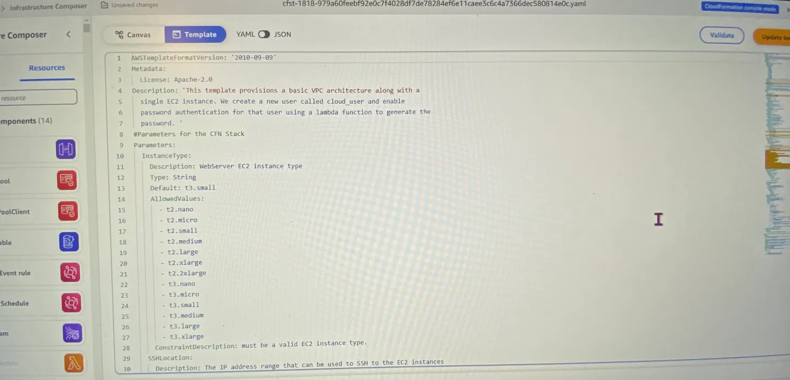
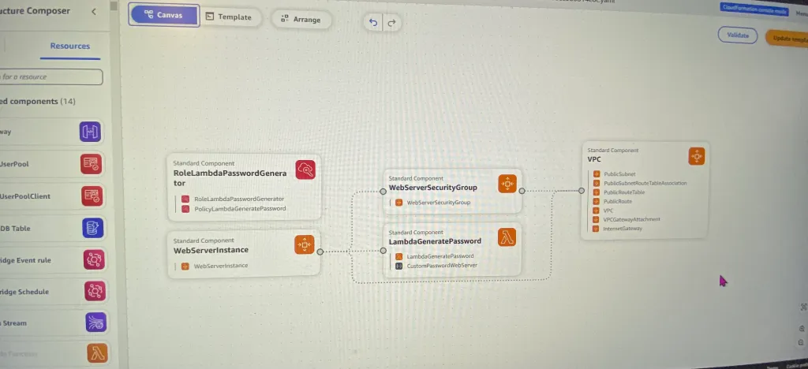
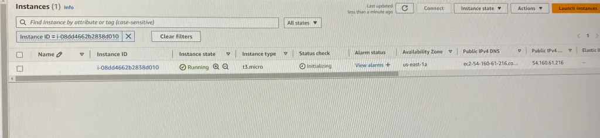

# 1. The Appetizer before configuring “t3.micro” & Updating the stack:

- https://github.com/aws-cloudformation/aws-cloudformation-templates

# 2. Configure InstanceType Parameter to “t3.micro”:

- After maneuvering to your CloudFormation stack & selecting update – take a peak at the template as seen below.
- Don’t fret, all these lines can be leveraged from the link above in the github repository.
- Screenshot below shows the “Default: t3.small” that requires update

- This is a perty-neat feature I thunk you would find dope. Instead of lines of code, you can mold your own visual CloudFormation by selections on the side.

# 3. Launch Updated stack & ensure EC2 can connect:

- Queue Jeopardy theme song…
-  After a couple minutes you will see updates to your template. Scroll down to find your instance ID to see if your instance update is complete:

