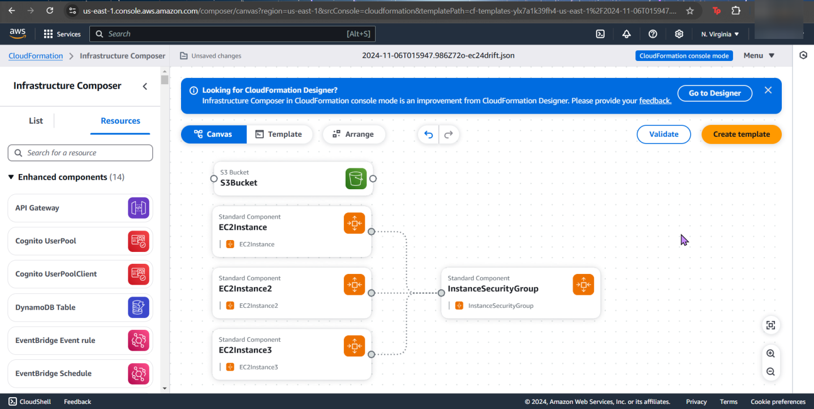
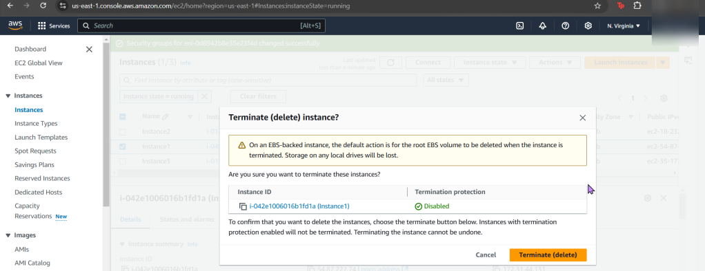
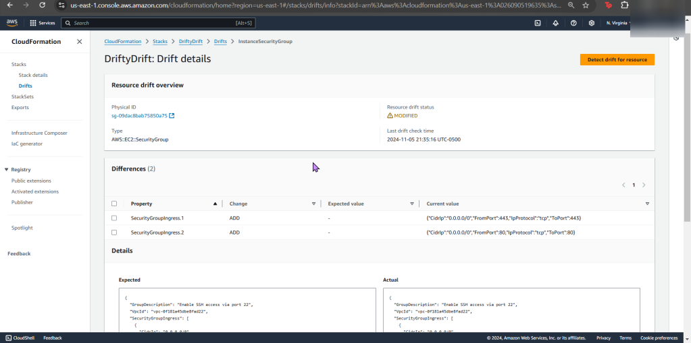
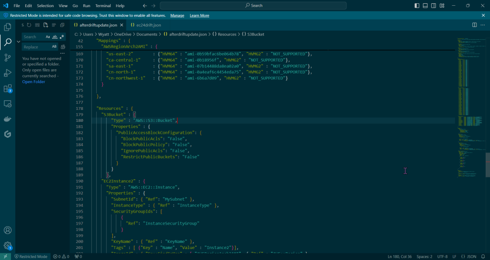
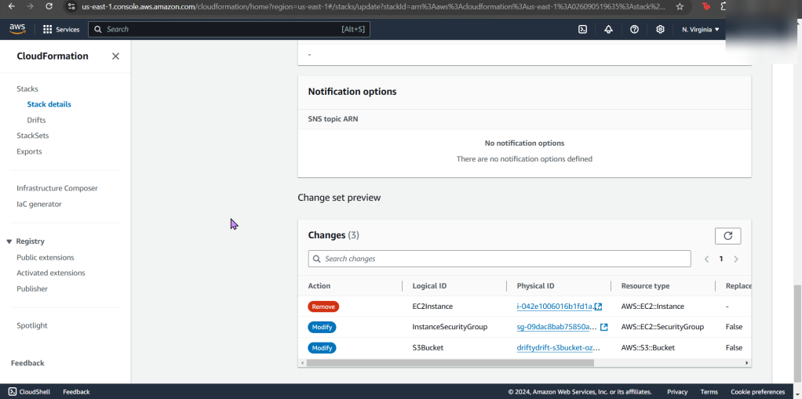
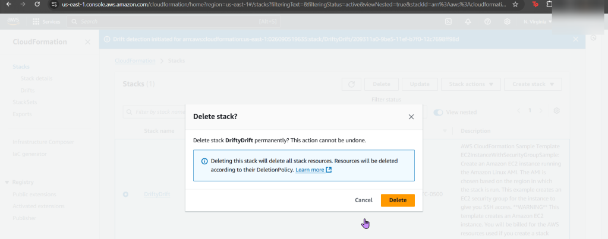

# ** Pre-Req: ** 
- Configuration draft is like poetry, & everyone hates poetry…
- Cloudformation can assist in bringing the stack back in sync to the original template after IDing the drift.

# 1. Create CloudFormation Stack
a. Create key pair
b. Create CF stack
- I think what AWS has in the “infrastructure composer” is sick, both options of “canvas” and “template” are so slick, also toggling between “YAML” & “JSON” is epic!

- Tahhhhh DAhhhhhhhhhhhhhhhhhh!!!!

# 2. Terminate an EC2 instance for stack drfit

- Annnnnd now its time to run some EVILLL experiments, muuhh-hahahaha… ahemm..Go to your EC2 instances

- Go to S3 
- You can see the details of your drift detection & compare the before/after

# 3. Eliminate drift from stack

- Put the “afterdriftdetection” file in & prepare for re-upload

# 4. Update Stack to Eliminate Drift:

- Go giggles, you can manually re-add the security group and re-enable the s3 static web hosting… OR just upload the other file & see the magic happen.
- Cuz as as seen above, AWS tells you the difference for the drift & w/that code you can re-update the file for re-upload. #ohhhyeaaaaah

- Dont forget to delete your stack if your done, orrrr it will stay there – – – … 4Evahhhh

