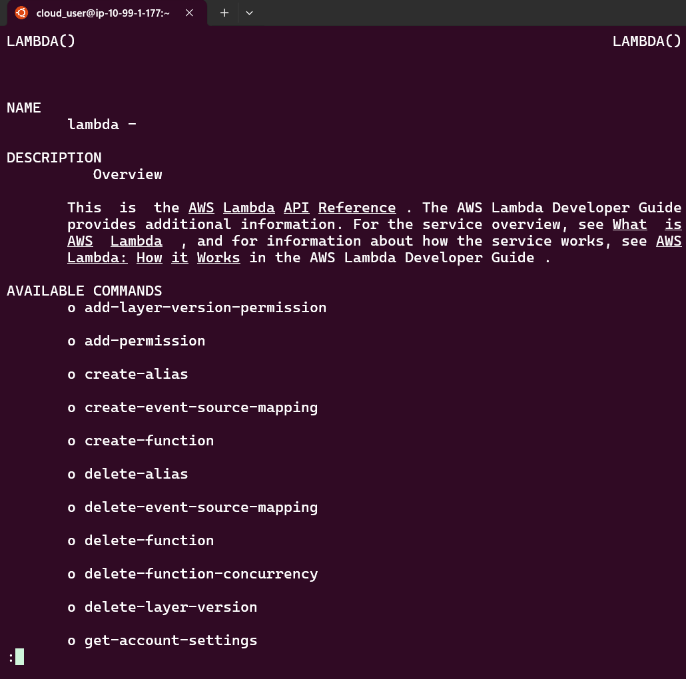
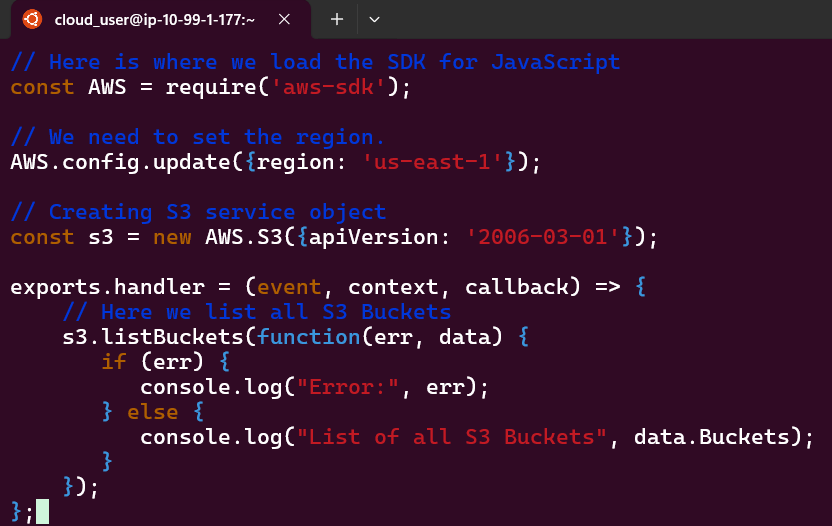
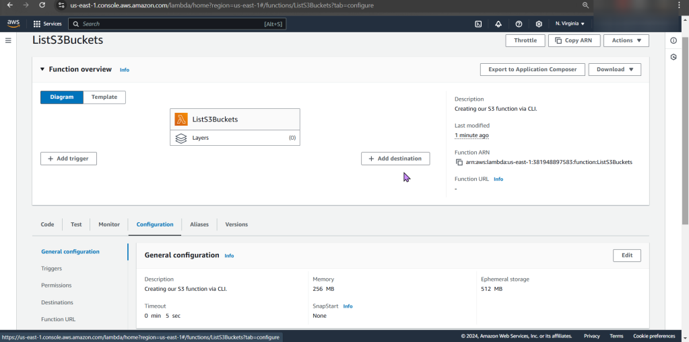
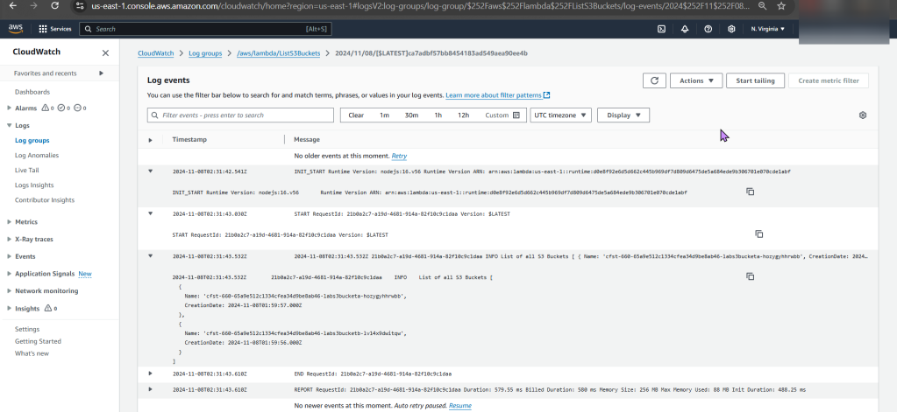

# 1. Create Lambda function using AWS CLI
- Create 2 S3 buckets & EC2, after that utilize IP address for SSH login
a. To ensure AWS is installed properly, conduct the following commands
- aws help
- aws lambda help

# 2. Create & Invoke Function using AWS CLI:
- After ensuring you lambda can be located in the S3 bucket region you located it, vim the file, next zip it.

- Wallah, alas.

