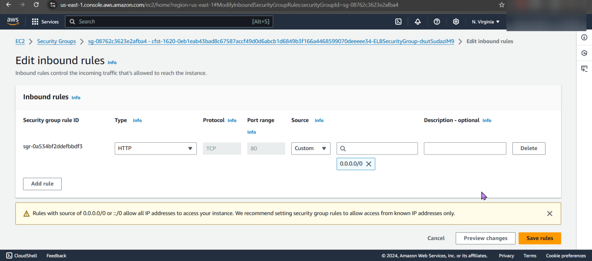
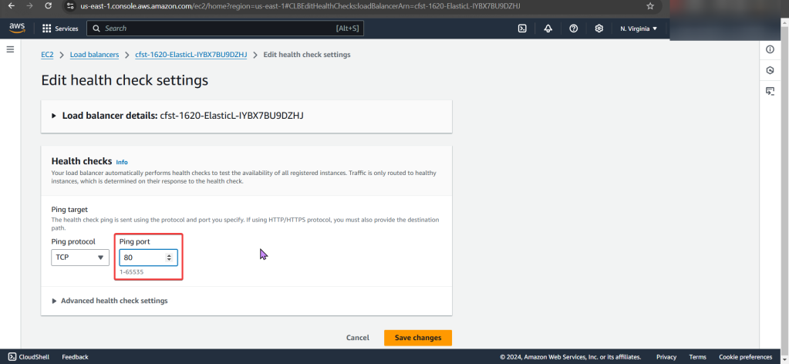

# 1. How to fix ELB security group that does NOT allow HTTP traffic
a. ELB Security Group Order of Operations
- Under EC2, Scroll to "Load-Balancer", Select "Security"
b. Next look at “Security Groups”. 
- We notice that there is only 1 inbound rule, for port 22…
c. Fix/Solution:
- Add Allow rule for HTTP traffic on port 80 to ELB security group

# 2. EC2 instance health checks are not passing
a. EC2 Health Check Order of Operations
- Under Load Balancers, Select Health Checks, You see the wrong ping port.. CHANGGGGE IT
b. Fix/Solution:
- Change health check “ping port” on ELB to port 80
- Now you can test the DNS name to see your webpage working properly.

