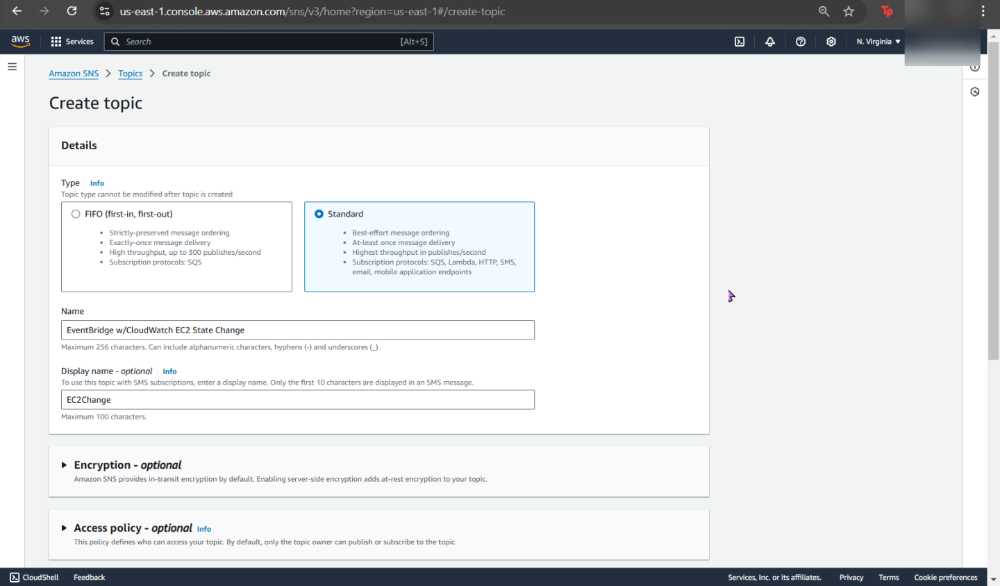
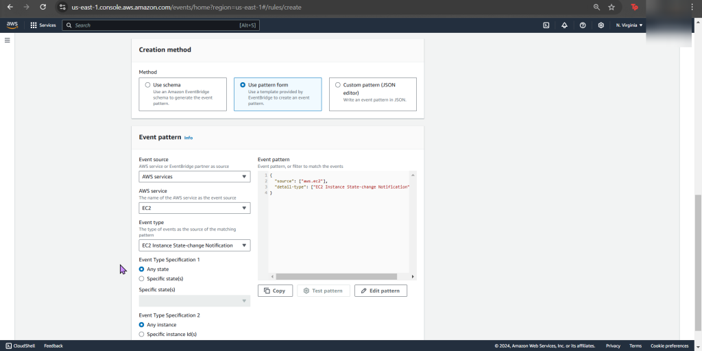
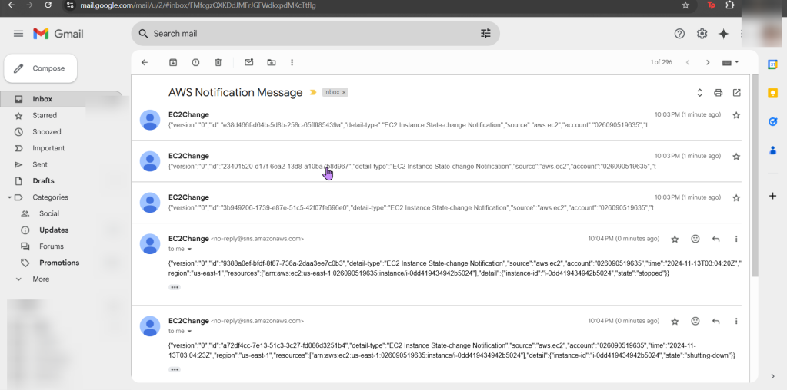

# 1. Create SNS & add email address

# 2. Create Amazon EventBridge rule to trigger SNS when EC2 state changes

# 3. Change state of EC2 & verify change in CloudWatch logs from a SNS notification

