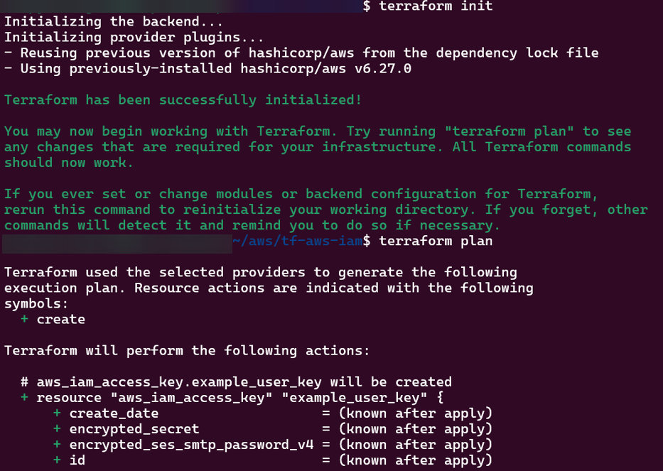
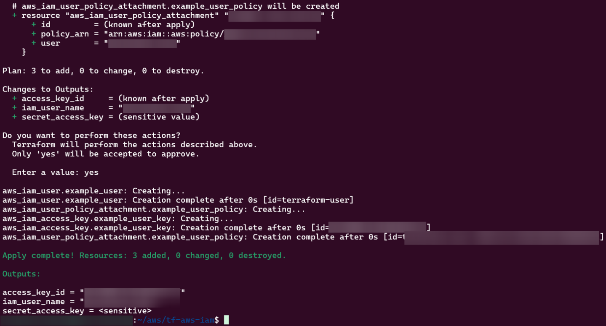

# 1. Order of Operations:
a. logged into AWS
b. aws configure
c. Created 4 tf files
- main

main.tf
provider "aws" {
  region = var.aws_region
}

# Create IAM user
resource "aws_iam_user" "example_user" {
  name = var.user_name
}

# Attach policy to the user
resource "aws_iam_user_policy_attachment" "example_user_policy" {
  user       = aws_iam_user.example_user.name
  policy_arn = var.policy_arn
}

# Create access keys for the user
resource "aws_iam_access_key" "example_user_key" {
  user = aws_iam_user.example_user.name
}

- variables

variables.tf
variable "aws_region" {
  description = "AWS region"
  type        = string
  default     = "us-east-1"
}

variable "user_name" {
  description = "IAM username"
  type        = string
  default     = "example-user"
}

variable "policy_arn" {
  description = "IAM policy ARN to attach"
  type        = string
  default     = "arn:aws:iam::aws:policy/AmazonS3ReadOnlyAccess"
}

- output

output.tf
output "iam_user_name" {
  value = aws_iam_user.example_user.name
}

output "access_key_id" {
  value = aws_iam_access_key.example_user_key.id
}

output "secret_access_key" {
  value     = aws_iam_access_key.example_user_key.secret
  sensitive = true
}

- tfvars

terrform.tfvars
aws_region = "us-east-1"
user_name  = "terraform-user"
policy_arn = "arn:aws:iam::aws:policy/AdministratorAccess"

d. TF Cmmds
- terraform fmt
- terraform init
- terraform plan
- terraform apply

