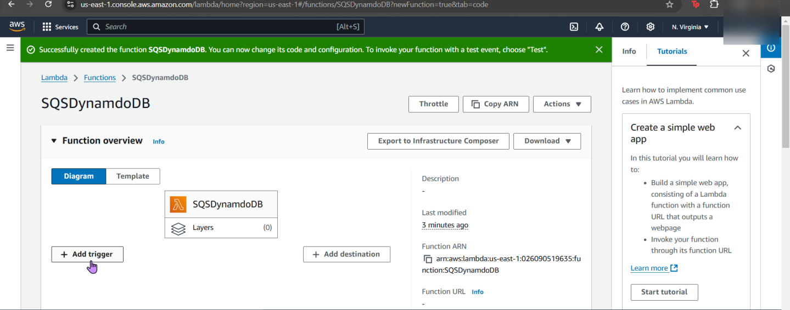
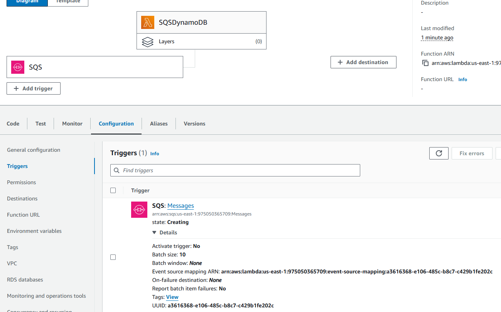
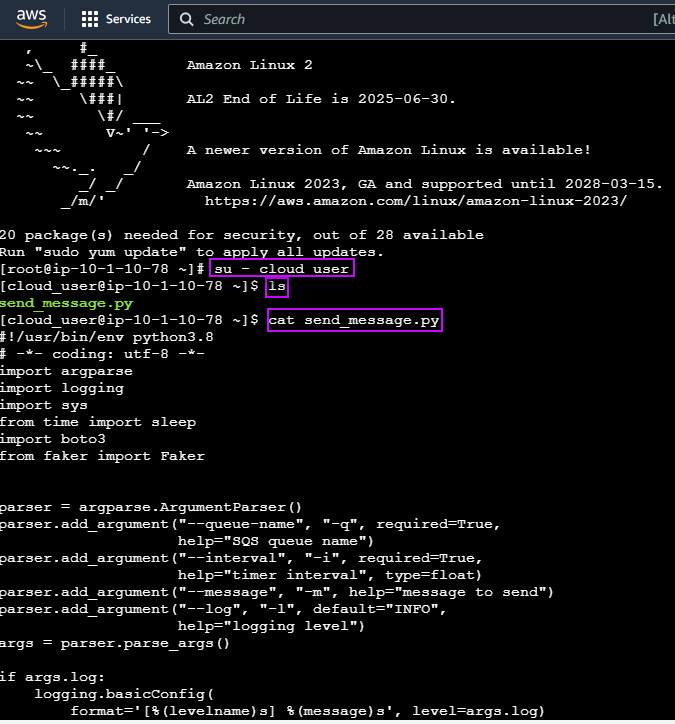
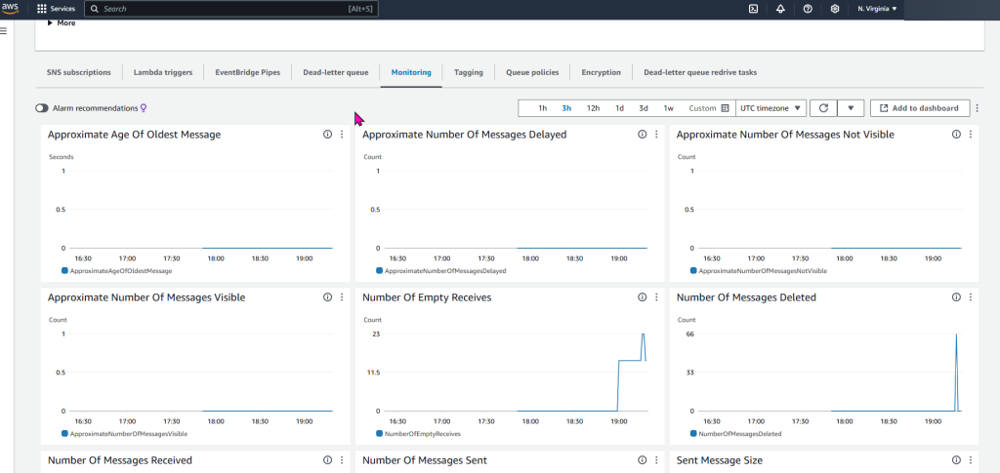

# 1. Create Lambda function
a. 3 minor details to utilize:
- Name = SQS DynamoDB
- Use = Python 3.x
- Role = lambda-execution-role
- Alright, whew – now thats over w/it….

# 2. Create SQS trigger
- Are you triggered bro? Hopefully “SQS” & “Messages” trigger you…
- Important note – create a SQS message, so when creating the trigger – you can snag that message created in SQS

# 3. Copy source code into Lambda function
- Copy-n-pasta into the lambda_function.py…. now destroy .. ahem, DEPLOY HIM!!

# 4. Go to console for the EC2 & test the script
- Sign your life away & see what the damage is! (aka: go to your EC2 instance)

# 5. Double check messages were placed into the DB
- After you checked EC2, lets double… quadruple? You checked it 1x, so your checking 2x? Or is it multiples of 4?.. idk regardless, you can look at your DB to see if you have a message from Lambda. Have at it.
- Below is what SQS & Dynamo DB prolly looks like

