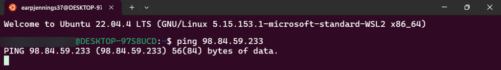
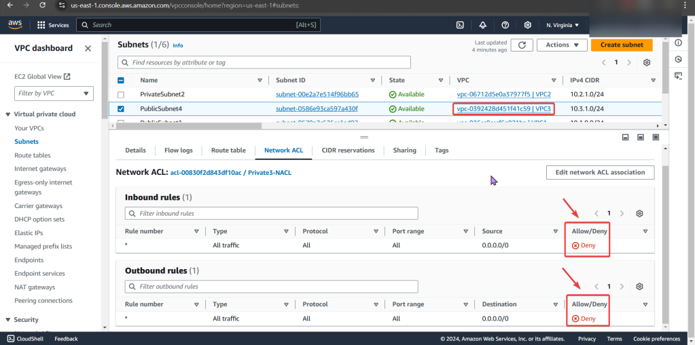
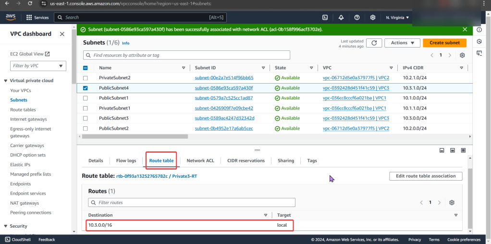
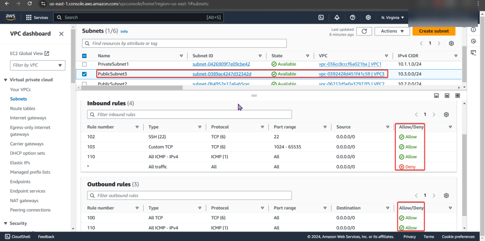
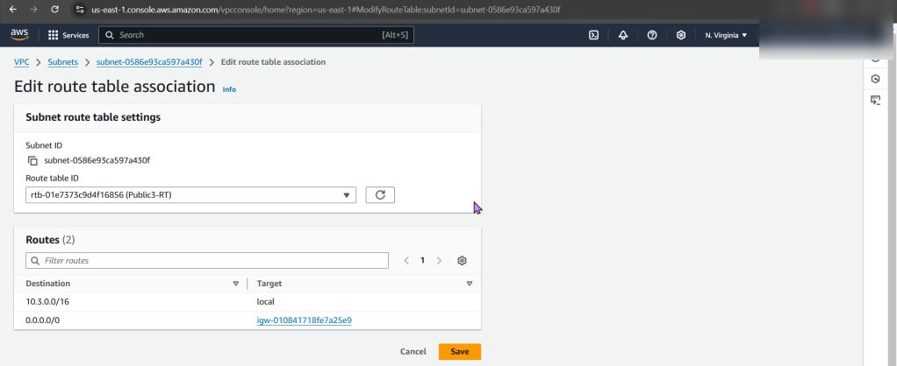

# 1. Important Notes:
- We have 3 VPCs w/SSH connection & NACLs configured through route table
- Instance 1 & 2 have connection to internet & are a-okay…
- Instance 3 is not connected to the internet, so we outtah’ figure out the problem.

# 2. Order of Operations:
- Instance
- Security Group
- Subnet
- NACL
- Route table
- Internet gateway

# 3. Solution:
- Instance
- No public IP address
- NACL
- Deny rules for inbound & outbound that prevents all pinging & traffic to instance
-Route Table
- Did not have route to internet gateway

# 4. Determine why instance cant connect to internet
a. Instance:
- No public IP Address
b. Security groups:
- Can we ping the instance
- Remember when looking at rules, just cuz says private – doesn’t mean it is! So check the inbound/outbound rules details

c. Subnet:
- Look at private IP address & then VPC
- Specifically under subnets pay attention to the VPC ID 
d. NACLs:
- We found the issue!! 
- The NACL rules deny all inbound/outbound traffic into the instance!
- Even tho the security group does allow traffic, remember the order of operations from in-to-out..

e. Route Table:
- Ah-ha! We found the issue…again!
- There is no route to the internet gateway

# 5. ID issues preventing instances from connecting to the internet
a. Instance:
- Allocate an Elastic IP Address, not a public one!!
b. NACLs:
- Options we have are:
1. Change the NACL security rules
2. Get a different NACL w/proper rules in it
3. In prod… dont do this cuz it can affect all the subnets inside of it.
- Under public-subnet4 (which was the original VPC ID we had for instance 3), select edit network ACL association, & change to the NACL to the public-subnet3

c. Route Tables:
- Options we have are:
1. Add a route to the table that allows traffic to flow from subnet to internet gateway
2. Remember in other environments, there maybe others using this route table only permitting private access, so not modify.
3. Select route table that has appropriate entries
- Here we edit the route table association & then notice the difference in the route table permitting connection/traffic

# PING PING PING PING ! ! ! ! !