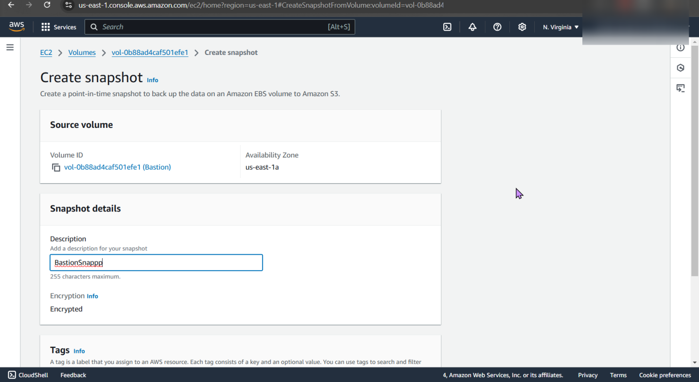
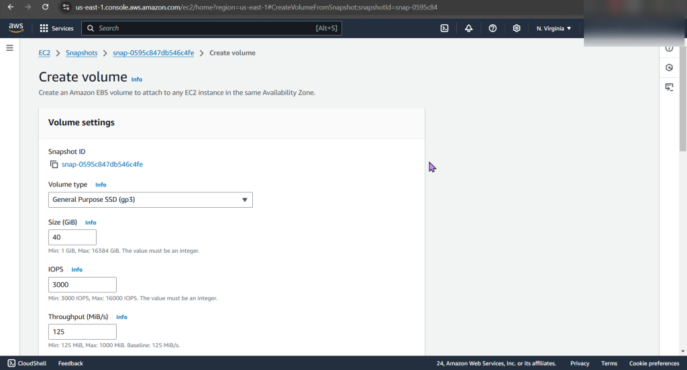
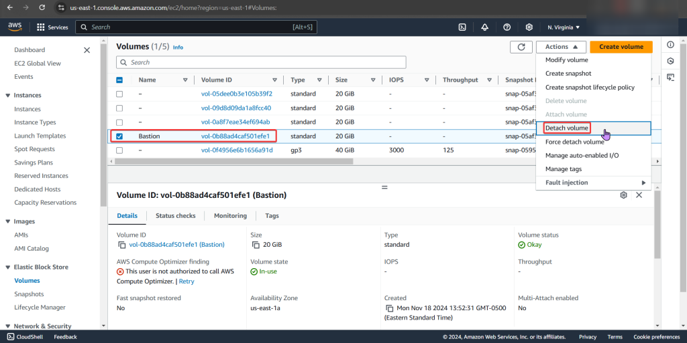
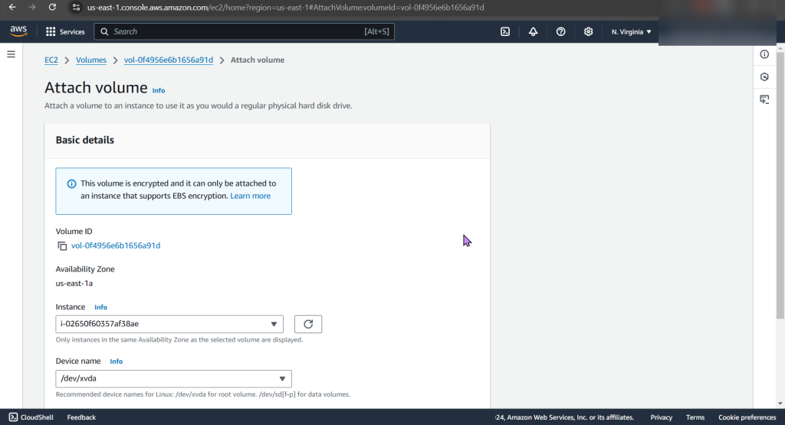
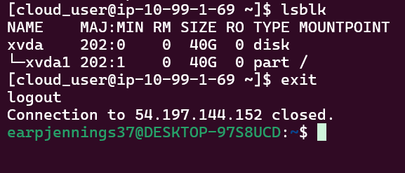
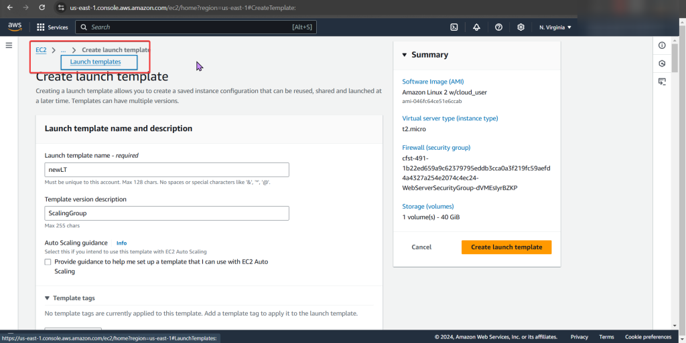

# 1. Create an EBS snapshot

# 2. Create a bigger, better EBS volume

# 3. Attach a bigger, better EBS volume to an EC2

# 4. Create a auto-scaling template & update the current auto-scaling group

a. TERMINATE!!!
- If you can delete/terminate instances, then your fault tolerant! Scorrrrrrrrrrrrrre