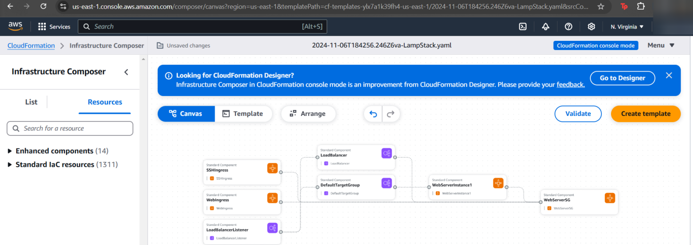
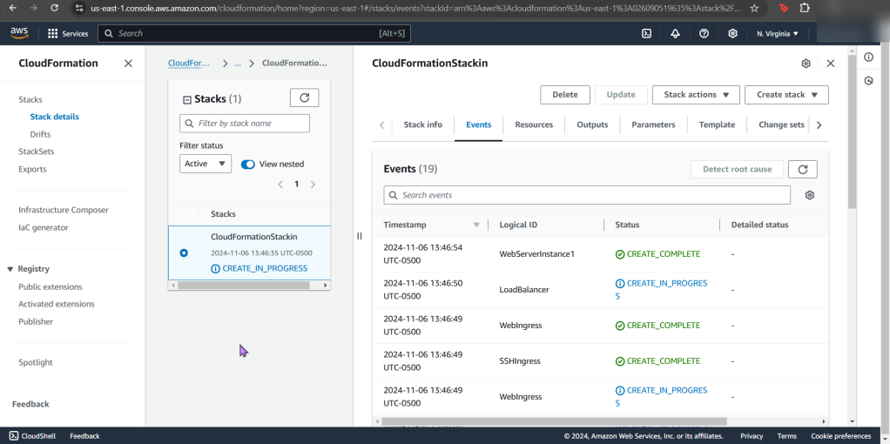
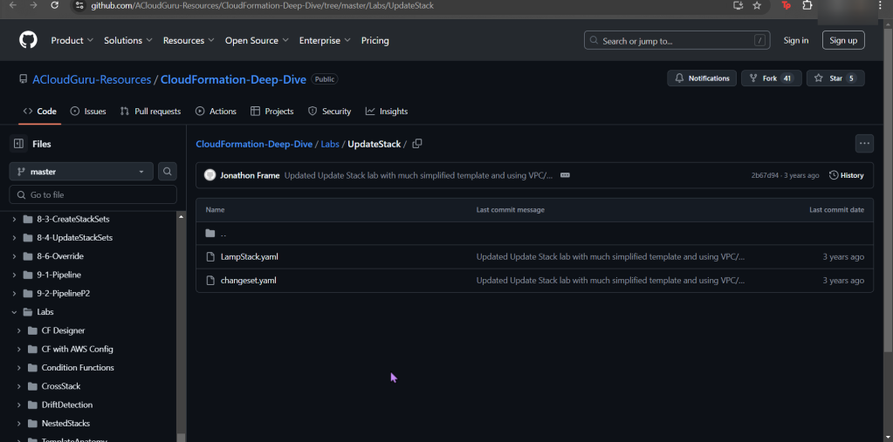
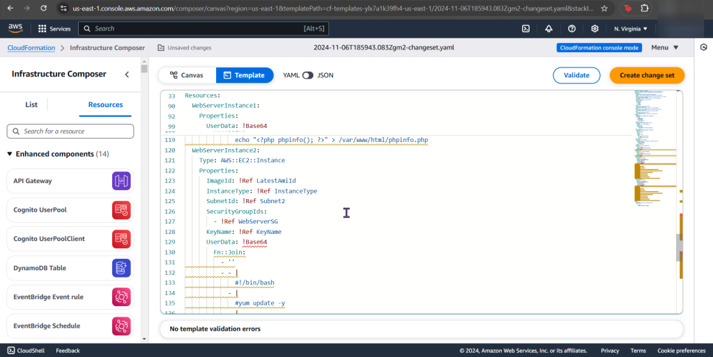

# 1. Deploy a stack using AWS CloudFormation Templates

- How are you stackin' up??

# 2. Update stack to scale up
- Yeah, you know what to do. Update the stack EC2 instance to medium. Just do it.

- To double-check your work, snag that http above in “value”.
- See the same test page!?

# 3. Update stack to scale out
- Lastly snag that bottom yaml file & re-upload into your stack #CHAAAAANGE

- Scroll to bottom of seeing the summary of changes. And like before, see the changes happening live!
- I know, fancy – ooooo ahhhh

