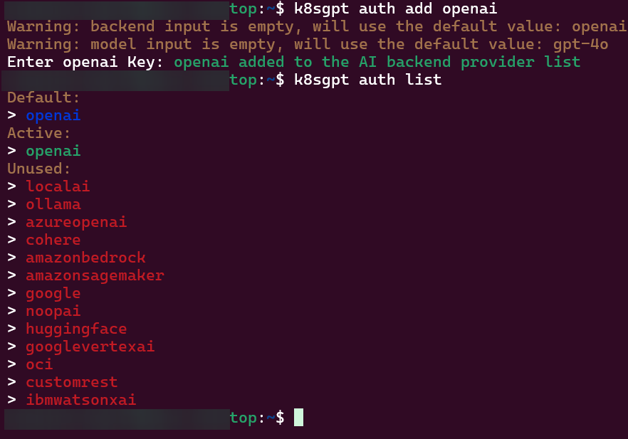
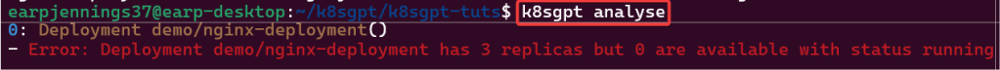
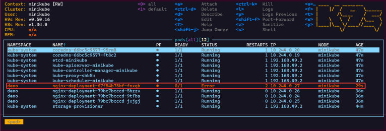
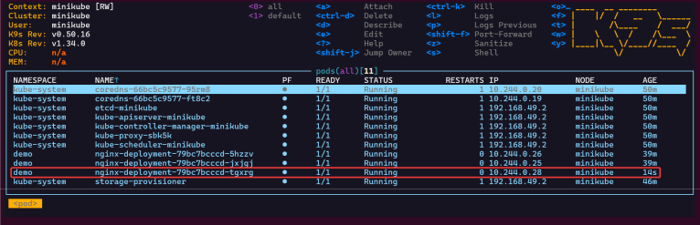
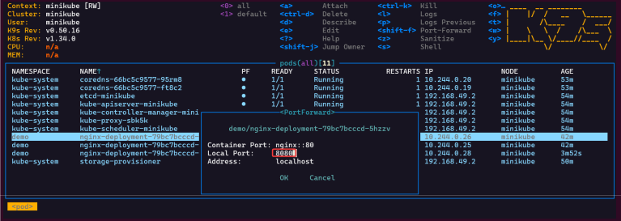
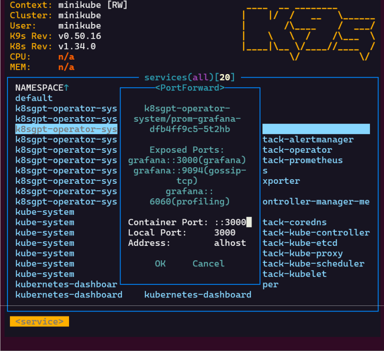
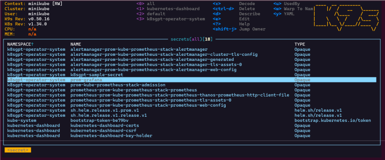
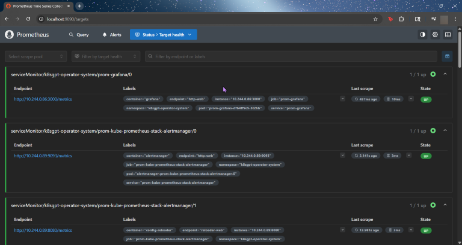
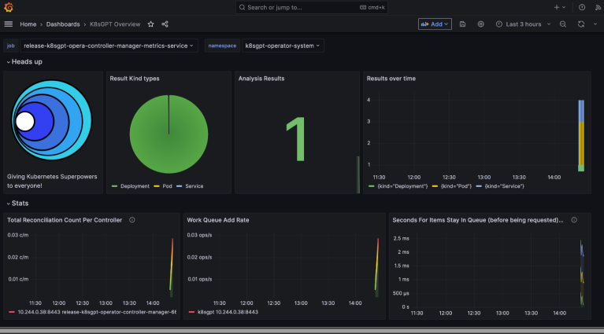

# Blog post includes installing K8s…GPT, see below for the goodies:

# 1. Installzz:
a. Github
- https://github.com/k8sgpt-ai/k8sgpt
b. k8sgpt Docx:
- https://docs.k8sgpt.ai/getting-started/in-cluster-operator/?ref=anaisurl.com
c. Ubuntu
- curl -LO https://github.com/k8sgpt-ai/k8sgpt/releases/download/v0.4.26/k8sgpt_amd64.deb
- sudo dpkg -i k8sgpt_amd64.deb
- k8sgpt version
- k8sgpt --help (handful of commands & flags available)

# 2. Pre-Reqzz:
a. Minikube
- unset KUBECONFIG
- minikube start
- minikube status
b. OpenAi
- https://platform.openai.com/account/api-keys
c. K8sgpt
- k8sgpt generate
- k8sgpt auth add openai
- k8sgpt auth list

# 3. Troubleshoot why deployment maybe NOT running:
- Create yaml file
- Create namespace
- Apply file
- Review K9s
- Utilize k8sgpt to see what’s going on…

# 4. Links to Leverage:
- https://github.com/AnaisUrlichs/k8sgpt-tuts.git
- roof grr – K9 Unit

# 5. Commandzz to Start:
- kubectl create ns demo
- kubectl apply -f deployment2 -n demo
- k8sgpt analyse
- k8sgpt analyse --explain

# 6. Commands to set pods, deployments:
a. Commands to check your deployment
- kubectl get pods -n demo
- kubectl get pods -A
- kubectl get deployments -n demo
- kubectl get pods --all-namespaces
- k8sgpt integration list
- k8sgpt filters list
- k8sgpt analyse --filter=VulnerabilityReport
- vi deployment2
- kubectl apply -f deployment2 -n demo

b. Notice an error?

- Change under securitycontext: readOnlyRootFilesystem: False
- FIXED!!

- Port-Forward to ensure pod access

# 7. K8s Operator:
- brew install helm
- helm repo add k8sgpt https://charts.k8sgpt.ai/
- helm repo update
- helm install release k8sgpt/k8sgpt-operator -n k8sgpt-operator-system --create-namespace --values values.yaml
a. Commands to see if your new ns installed:
- kubectl get ns
- kubectl get pods -n k8sgpt-operator-system
- k9s

# 8. ServiceMonitor to Send Reports to Prometheus & Create DB for K8sGPT:
- helm repo add prometheus-community https://prometheus-community.github.io/helm-charts
a. kube-prometheus-stack has been installed. Check its status by running:
- kubectl --namespace k8sgpt-operator-system get pods -l "release=prom"
b. Get Grafana 'admin' user password by running:
- kubectl --namespace k8sgpt-operator-system get secrets prom-grafana -o jsonpath="{.data.admin-password}" | base64 -d ; echo
c. Access Grafana local instance:
- export POD_NAME=$(kubectl --namespace k8sgpt-operator-system get pod -l "app.kubernetes.io/name=grafana,app.kubernetes.io/instance=prom" -oname)
- kubectl --namespace k8sgpt-operator-system port-forward $POD_NAME 3000
d. Get your grafana admin user password by running:
- kubectl get secret --namespace k8sgpt-operator-system -l app.kubernetes.io/component=admin-secret -o jsonpath="{.items[0].data.admin-password}" | base64 --decode ; ech

# 9. OpenAi API-Keyzz for K8s Secret:
- export OPENAI_TOKEN=<YOUR API KEY HERE>
- kubectl create secret generic k8sgpt-sample-secret --from-literal=openai-api-key=$OPENAI_TOKEN -n k8sgpt-operator-system
 
apiVersion: core.k8sgpt.ai/v1alpha1
kind: K8sGPT
metadata:
  name: k8sgpt-sample
  namespace: k8sgpt-operator-system
spec:
  ai:
    enabled: true
    model: gpt-4o-mini
    backend: openai
    secret:
      name: k8sgpt-sample-secret
      key: openai-api-key
  noCache: false
  version: v0.4.26

a. K9s results, port-forward, password, etc.:
kubectl apply -f k8sgpt-resource.yaml -n k8sgpt-operator-system k9s
- services, shift-f, port-forward prometheus-operated:9090
- kubectl get results -n k8sgpt-operator-system
- kubectl port-forward service/prom-grafana -n prom 3000:80

- To find Grafana Password; secrets & press-x

- Prometheus

- Grafana

