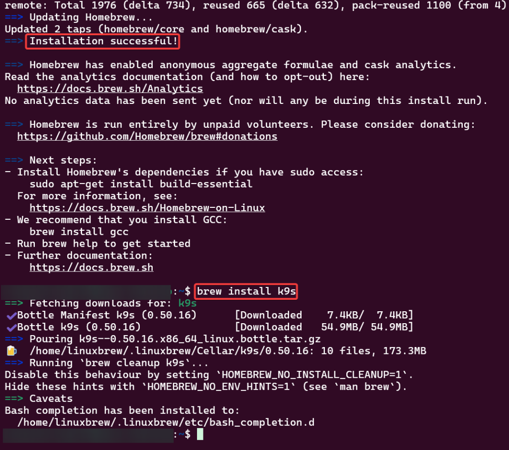

# Pre-Req Stuff To-Do List:
1. https://k9scli.io/topics/install/

2. https://github.com/derailed/k9s

# Install K9s!
https://brew.sh/

# 1st Command
/bin/bash -c "$(curl -fsSL https://raw.githubusercontent.com/Homebrew/install/HEAD/install.sh)"
# 2nd Command
brew install k9s

