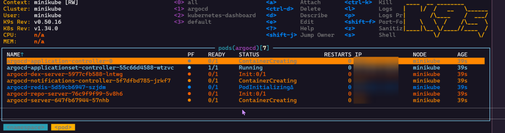
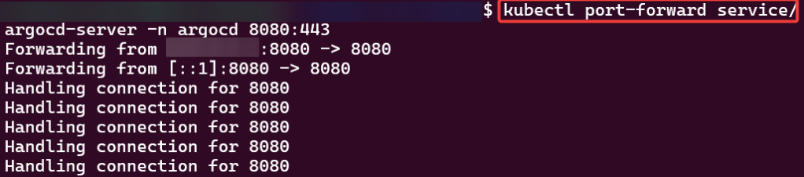
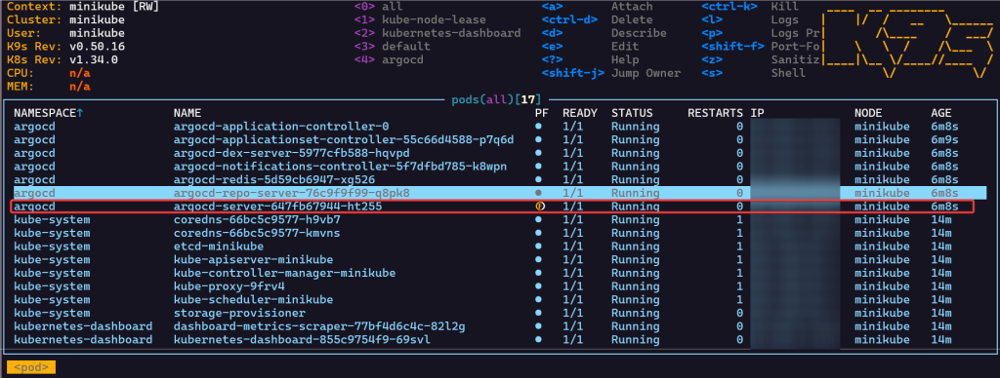
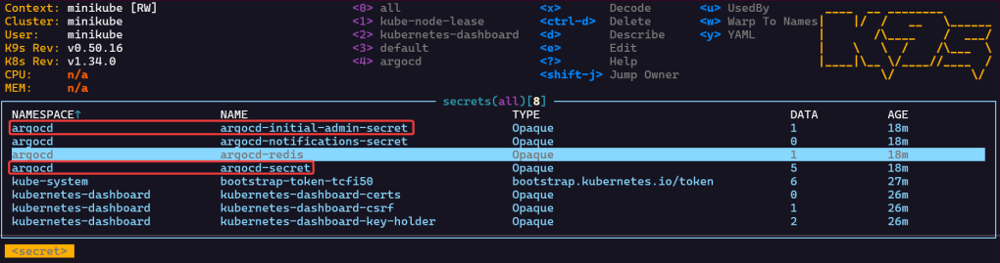
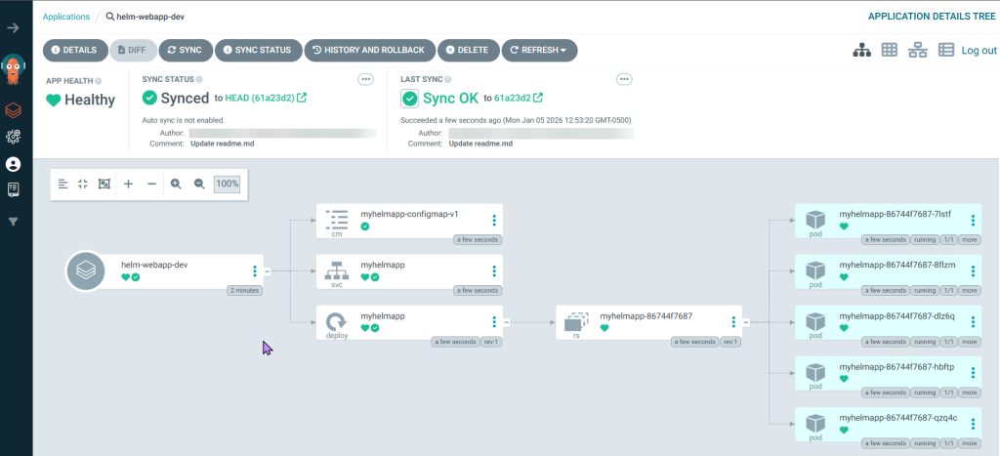
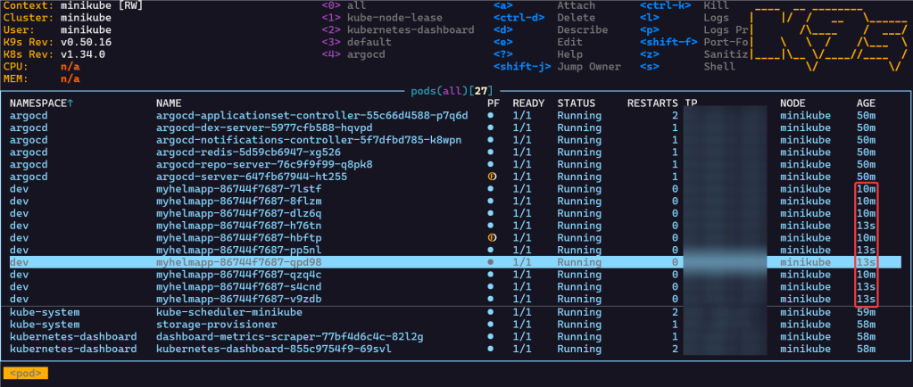
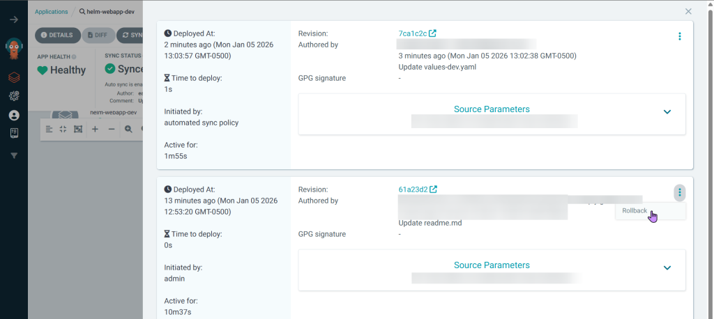
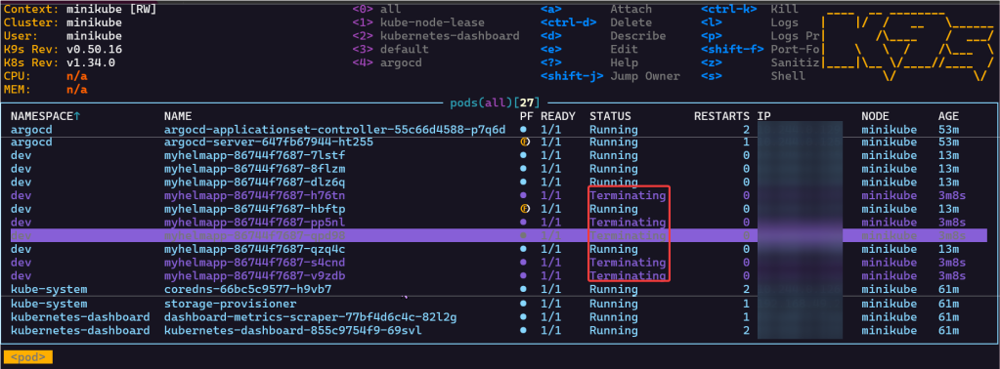

# 1. Install ArgoCD:
- brew install argocd
- kubectl port-forward svc/argocd-server -n argocd 8080:443
- argocd login 127.0.0.1:8080

# 2. Code:
- kubectl create namespace argocd
- kubectl apply -n argocd -f https://raw.githubusercontent.com/argoproj/argo-cd/stable/manifests/install.yaml

# 3. Port-Forward:
a. CLI Option

b. K9s Option

# 4. Secret Password:
a. CLI Option
- kubectl -n argocd get secret argocd-initial-admin-secret -o jsonpath="{.data.password}" | base64 -d

b. K9s Option
- go to secrets
- hit x on the preferred option you desire
- initial admin secret – login to argocd
- secret – to get RSA private keys

# 5. Helm Chart Install:

# 5. Scale-Up Replicas to 10:
- Update your github file & commit
- Watch MAGIC..or “agentic-ai” – whatever you wanna call it
- Notice in k9s the pods age

# 6. Rollback in ArgoCD:
- ArgoCD terminate

- K9s terminate
