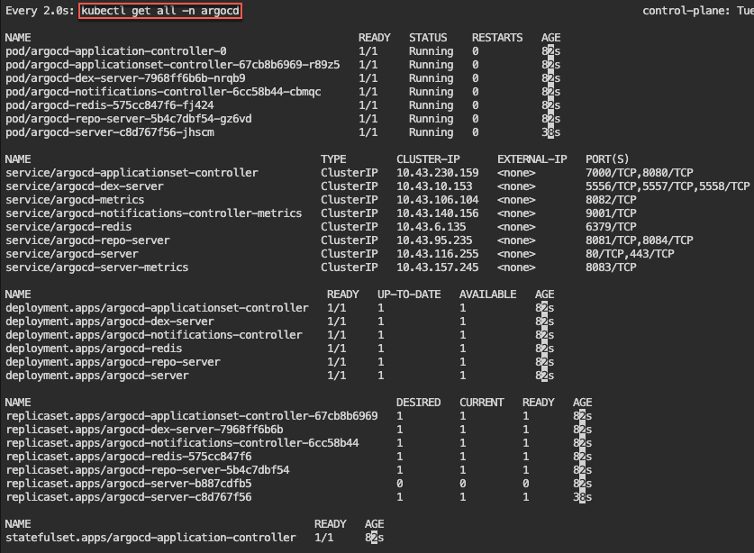
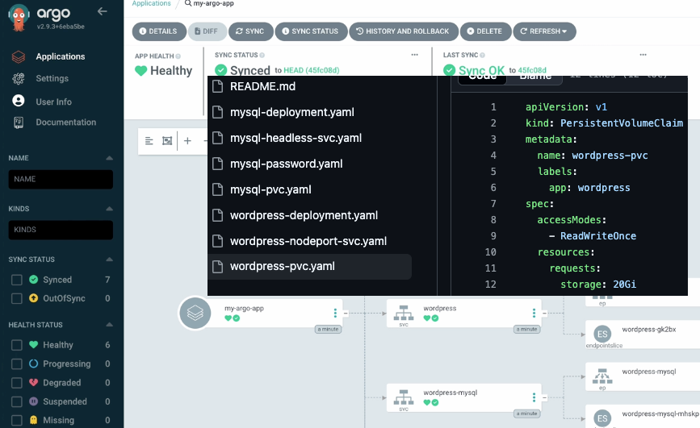

# 1. Blog post includes covering Cloud Application Delivery in preparation for the KCNA.
a. https://github.com/spurin/argo-f-yourself
-  kubectl create namespace argocd
- kubectl apply -n argocd -f https://raw.githubusercontent.com/argoproj/argo-cd/stable/manifests/install.yaml
- watch --differences kubectl get all -n argocd

-  kubectl -n argocd get secret argocd-initial-admin-secret -o jsonpath="{.data.password}" | base64 -d
- kubectl -n argocd get svc

