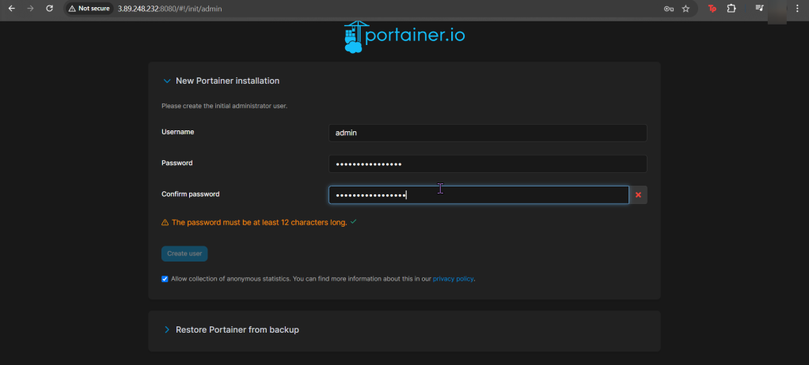
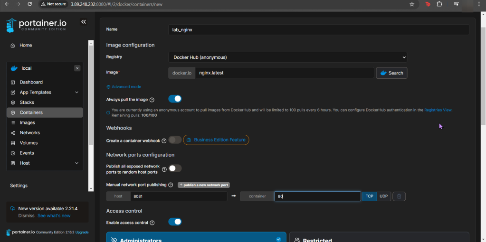

# 1. Create Volume & Portainer:
- SSH
- docker volume create portainer_data
- docker container run -d –name portainer -p 8080:9000 \
- docker container ls

# 2. Login to Portainer & Create Container:

- port 8081 from nginx:lastest image

