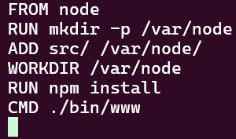
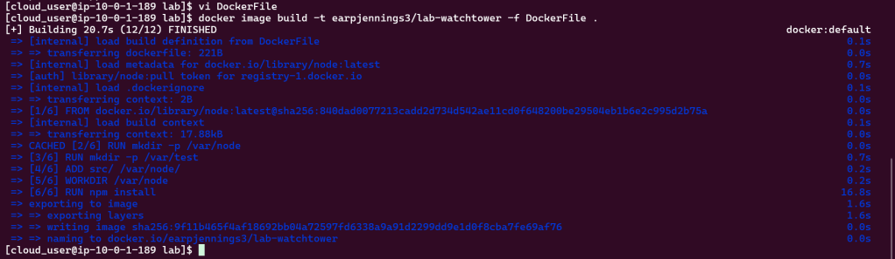
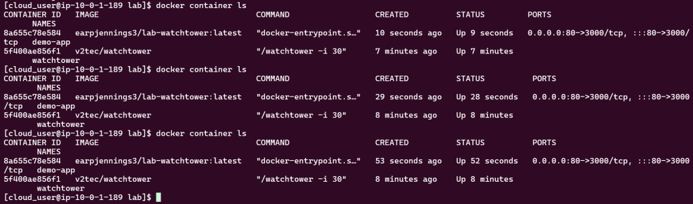

# 1. SSH & Create Dockerfile

# 2. Build Dockerfile
- docker image build -t earpjennings3/lab-watchtower -f Dockerfile .

- Push image to Docker Hub
- Create Watchtower container

- Update Docker image

