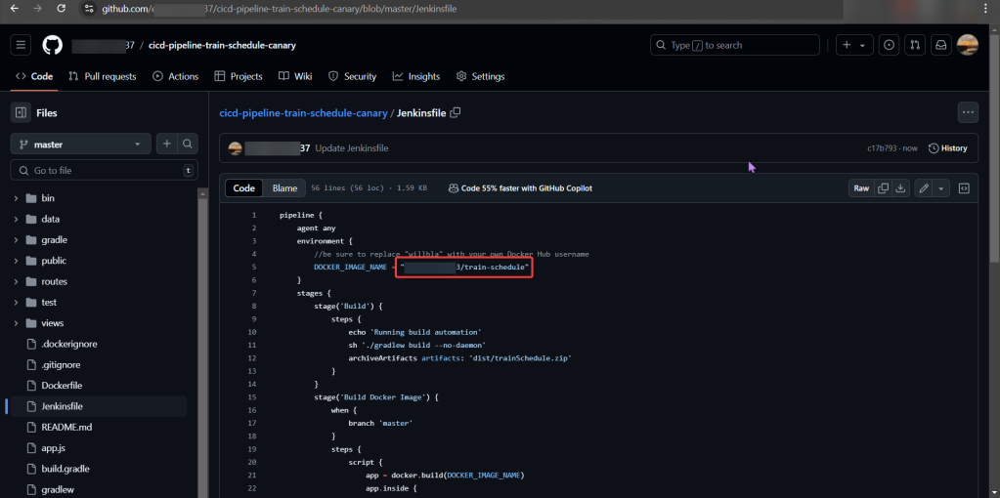
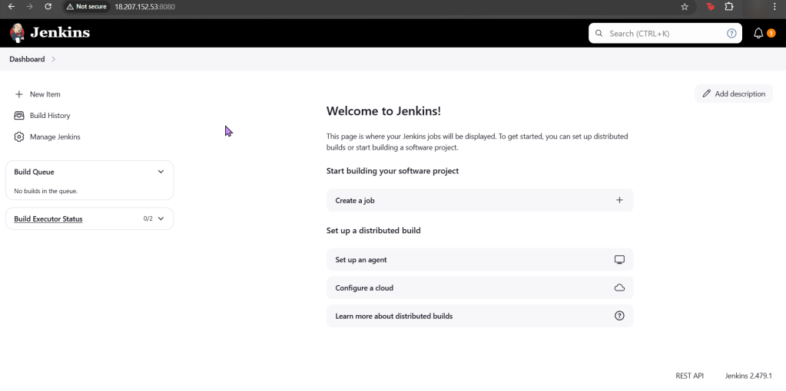
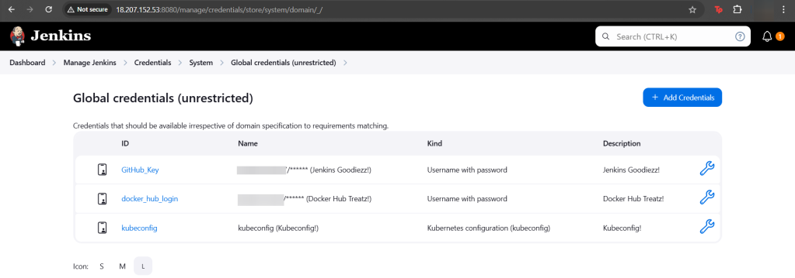
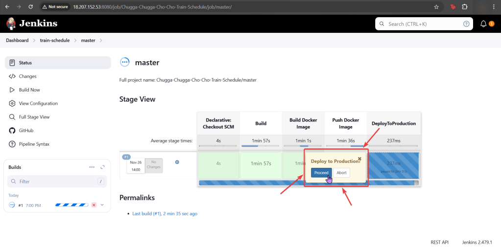
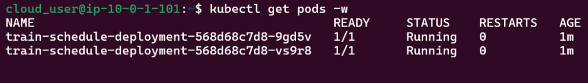
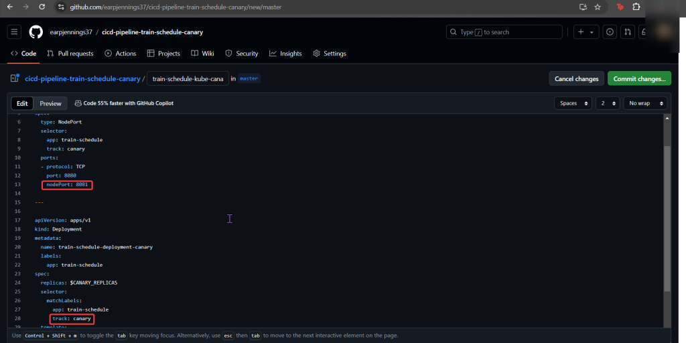
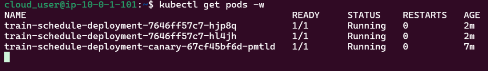

# 1. Run Deployment in Jenkins
- Source code forked

a. Jenkins:
- Setup Jenkins (Github access token, Docker Hub, & KubeConfig)

b. Github:
- Generate access token

c. DockerHub
- Does NOT generate access token

# 2. Add Canary to Pipeline to run Deployment

a. Create Jenkins Project
- Multi-Branch Pipeline
- Github username
- Owner & forked repository
- Provided an option for URL, select deprecated visualization

# 3. Canary Template:
- Pay Attention to track, spec, selector, & port

# 4. Add Jenkinsfile to Canary Stage"
- Between Docker Push & DeployToProduction
- We add CanaryDeployment stage!

# 5. Modify Productions Deployment Stage:

