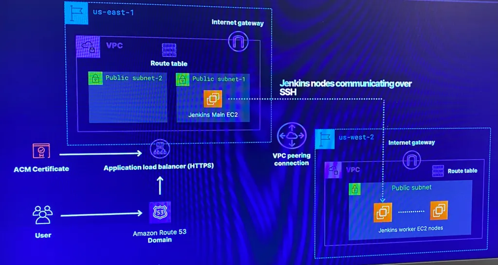

# 1. Deploy a distributed multi-region Jenkins CI/CD Pipeline

# 2. Include VPC (& of course peering!) along w/gateways, public subnets & security groups

# 3. In addition are EC2 that have Jenkins running w/main & worker nodes
- Place Jenkins main node behind an ALB that is attached to allow HTTPs traffic w/a SSL certificate from AWS certificate manager in a Route 53 public zone

# 4. Create Ansible playbooks to install software for Jenkins & apply configurations 

