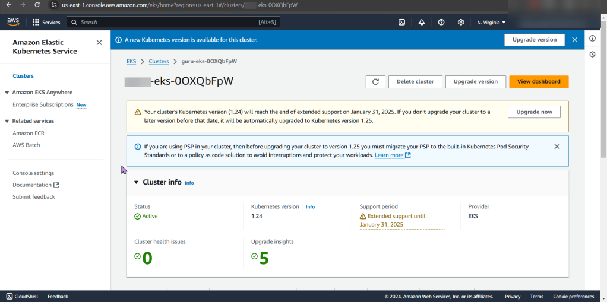

# 1.Installing Homebrew, AWS CLI, Kubernetes CLI, & Terraform
a. Homebrew
- https://brew.sh/
b. Brew Install
- AWS CLI
- Kubernetes-cli (kubectl)
- Terraform

# 2. Deploy EKS Cluster
- Create Access Keys
- Clone Repo
- Move into EKS Directory
- Initialize Directory
- Apply Terraform Configuration
- Configure Kubernetes CLI w/EKS Cluster

# 3. Are you connected bruh?

