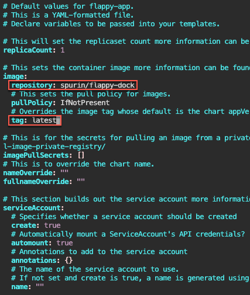
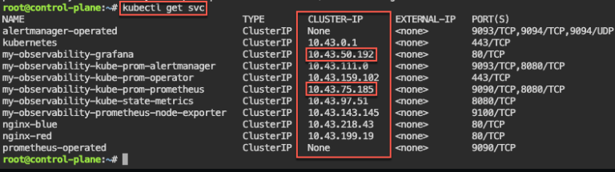
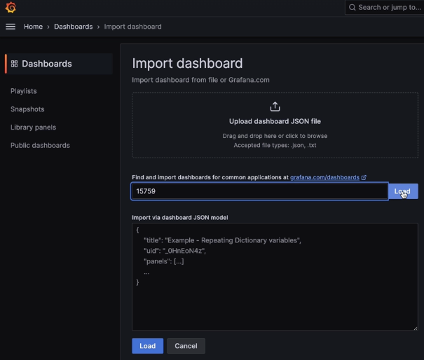
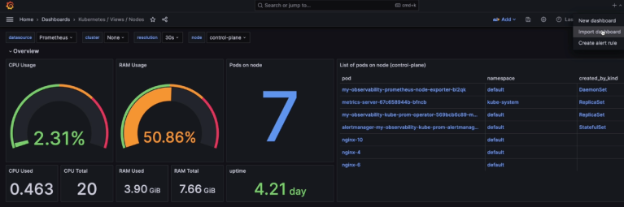

# 1. Helm Charts:
a. Installs
- apt update && apt install -y git tree
- curl https://raw.githubusercontent.com/helm/helm/main/scripts/get-helm-3 | bash
- d flappy-app
- vim Chart.yaml
- vim values.yaml

b. Kubectl xyz...
- helm install flappy-app ./flappy-app-0.1.0.tgz
- export POD_NAME=$(kubectl get pods --namespace default -l "app.kubernetes.io/name=flappy-app,app.kubernetes.io/instance=flappy-app" -o jsonpath="{.items[0].metadata.name}"); export CONTAINER_PORT=$(kubectl get pod --namespace default $POD_NAME -o jsonpath="{.spec.containers[0].ports[0].containerPort}"); echo "Visit http://127.0.0.1:8080 to use your application"; kubectl --namespace default port-forward $POD_NAME 8080:$CONTAINER_PORT
- kubectl get deployment; echo; kubectl get pods; echo; kubectl get svc

# 2. Prometheus & Grafana:
- apt update && apt install -y git
- curl https://raw.githubusercontent.com/helm/helm/main/scripts/get-helm-3 | bash
- helm repo add prometheus-community https://prometheus-community.github.io/helm-charts
- helm search repo prometheus-community/kube-prometheus-stack -l
- helm install my-observability prometheus-community/kube-prometheus-stack --version 55.5.0

- kubectl get all -A
- kubectl get svc
- for i in {1..10}; do kubectl run nginx-${i} --image=nginx; sleep 30; done
- helm uninstall my-observability
- kubectl -n kube-system delete service/my-observability-kube-prom-kubelet --now

# 3. 