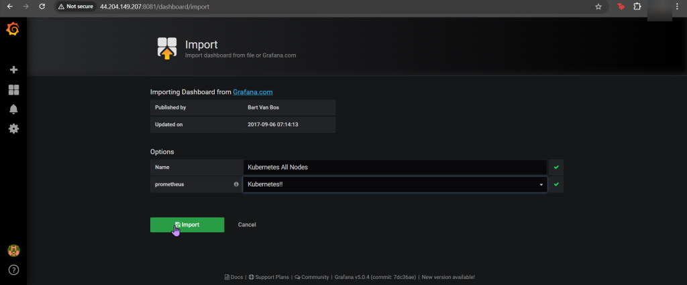

# 1. Use Helm to install Grafana
- SSH into Master Public IP
- Initiate Helm:
# 2. Install Prometheus in Kubernetes Cluster
- Create Prometheus YAML File
- Install Prometheus:
# 3. Install Grafana in Kubernetes Cluster
- Create Grafana YAML File
- Install Grafana
- Create Grafana-Extension YAML File
- Log-in to Grafana

